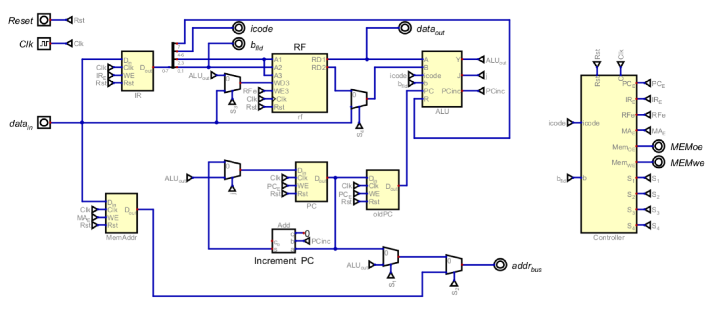
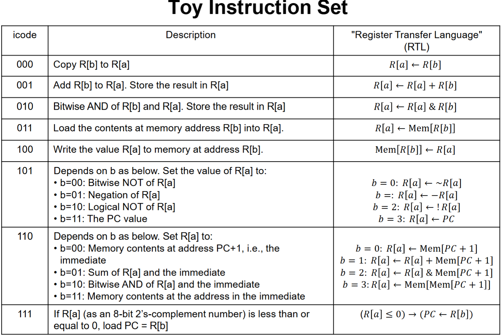

# Toy CPU — an 8-bit multi-cycle processor in VHDL

A small general-purpose CPU built from the gate level up: register file, ALU, datapath
multiplexing, a hardwired control unit, and a timing sequencer, all written in structural VHDL and
synthesized for a Cyclone V FPGA. No soft-core IP, no inferred processor blocks — every register,
mux, and decoder is an entity in [`rtl/`](rtl).



*The datapath and hardwired controller. Every block here is an entity in [`rtl/`](rtl) —
`oldPC` is `register_n` instance `b2v_PCold`, `MemAddr` is `b2v_MA`, and `S1`–`S4` are the mux
selects driven by [`control_signals_logic.vhd`](rtl/control_signals_logic.vhd).*

---

## Architecture

| | |
|---|---|
| Data width | 8 bits |
| Address width | 8 bits → 256-byte address space |
| Registers | 4 general-purpose (R0–R3), 8 bits each |
| Control | Hardwired — no microcode |
| Cycles per instruction | 3, except indirect load (4) |
| Memory interface | Single shared bus, `memoe` / `memwe` strobes |

**Instruction format.** One byte, no multi-byte opcodes:

```
 7     6  5  4     3  2     1  0
+---+ +----------+ +-----+ +-----+
| r | |  icode   | |  a  | |  b  |
+---+ +----------+ +-----+ +-----+
```

`a` selects the destination register, which is also the first ALU operand — so the machine is
two-address (`R[a] ← R[a] op R[b]`) rather than three-address. `b` doubles as the second
register select and as a sub-opcode for the unary and immediate groups, which is how eight
opcodes cover fourteen operations. In the RTL the `b` field is carried on the signal named
`b_fld`.

## Instruction set



*Instruction set as specified by the course; the implementation below was built to match it.*

The same table, in text — every row verified against [`rtl/alu.vhd`](rtl/alu.vhd) and
[`rtl/control_signals_logic.vhd`](rtl/control_signals_logic.vhd):

| icode | b | Operation | RTL |
|---|---|---|---|
| `000` | reg | Copy | `R[a] ← R[b]` |
| `001` | reg | Add | `R[a] ← R[a] + R[b]` |
| `010` | reg | Bitwise AND | `R[a] ← R[a] & R[b]` |
| `011` | reg | Load | `R[a] ← Mem[R[b]]` |
| `100` | reg | Store | `Mem[R[b]] ← R[a]` |
| `101` | `00` | Bitwise NOT | `R[a] ← ~R[a]` |
| `101` | `01` | Negation | `R[a] ← −R[a]` |
| `101` | `10` | Logical NOT | `R[a] ← !R[a]` |
| `101` | `11` | Read PC | `R[a] ← PC` |
| `110` | `00` | Load immediate | `R[a] ← Mem[PC+1]` |
| `110` | `01` | Add immediate | `R[a] ← R[a] + Mem[PC+1]` |
| `110` | `10` | AND immediate | `R[a] ← R[a] & Mem[PC+1]` |
| `110` | `11` | Load indirect | `R[a] ← Mem[Mem[PC+1]]` |
| `111` | reg | Branch if ≤ 0 | `(R[a] ≤ 0) → (PC ← R[b])` |

## How the control unit works

The sequencer is a 2-bit counter decoded into four one-hot time states, T0–T3. Control signals
are pure sum-of-products over (time state × decoded opcode) — for example:

```vhdl
memoe <= t0 OR (i3 AND t2) OR (i6 AND t2 AND (b0 OR b1 OR b2 OR b3)) OR (i6 AND b3 AND t3);
```

T0 fetches, T1 advances the PC, T2 executes and writes back. The counter clears at T2 for every
instruction *except* the indirect load, which needs T3 to make its second memory access:

```vhdl
clr <= t2 AND NOT(icode = "110" AND b_fld = "11");
```

That one term is the whole variable-length-instruction mechanism. Getting it right was the part
of the design that took the most iteration — an unconditional clear at T2 silently truncates the
indirect load, and the failure shows up as a register holding an address instead of the value at
that address.

The conditional branch is resolved in the ALU rather than the control unit: `j` asserts when the
first operand is zero or negative, and steers `MUX_j` so the PC loads the branch target instead
of PC+1 at T1.

## Verification

Four programs run against a behavioral RAM model ([`tb/ram.vhd`](tb/ram.vhd)) that loads
`address/data` hex text files at time zero, exercising a different path each:

| Program | Exercises |
|---|---|
| [`ProgramData0`](programs/ProgramData0.txt) | Immediate load, minimal smoke test |
| [`ProgramData1`](programs/ProgramData1.txt) | Register-register AND — `0x55 AND 0xFF` |
| [`ProgramData2`](programs/ProgramData2.txt) | Store to a register-held address |
| [`ProgramData3`](programs/ProgramData3.txt) | Indirect load — the 4-cycle path |

Run one from the `sim/` directory — the scripts use relative paths, so the working directory
matters:

```bash
vsim -do testbench3.do
```

Already inside the ModelSim GUI, `cd` to `sim/` and run `do testbench3.do` in the transcript
instead. For a non-interactive run, `vsim -c -do "do testbench3.do; quit -f"`.

Each script creates the `work` library, compiles the RTL in dependency order, elaborates the
testbench with the matching program file, and puts PC, IR, all four registers, and the full
memory array on the wave view.

## Synthesis results

Quartus Prime 20.1.1, Cyclone V `5CGXFC7C7F23C8` — full reports in [`reports/`](reports):

| Metric | Value |
|---|---|
| Logic utilization | 73 ALMs of 56,480 (< 1%) |
| Registers | 66 (PC, PC_prev, IR, MA, 4×8 register file, 2-bit counter) |
| Pins | 28 of 268 |
| Block memory / DSP / PLL | none — pure logic and flip-flops |

**On timing:** the project has no `.sdc`, so Quartus fell back to its default 1 ns period and
reports a −6.18 ns setup slack against an implied 1 GHz clock. That number is an artifact of the
missing constraint, not a real closure failure, and no meaningful Fmax should be read from it.
Writing a proper constraint file and reporting an honest Fmax is the first thing this project
needs.

## Known gaps

- **No timing constraints.** See above.
- **`register_file.vhd` exposes `q0_out`–`q3_out`** for waveform debugging that the component
  declaration in `datapath.vhd` does not bind. Legal VHDL — unassociated outputs are left open —
  but it is debug scaffolding that should come out.
- **No assertion-based self-checking.** The testbenches are inspected visually in the wave view;
  they do not pass or fail on their own. Self-checking benches with expected-value assertions
  would make regressions visible without a human reading waveforms.
- **`r` (bit 7) is decoded but barely used** — it suppresses the PC increment and the branch.
  It is effectively dead in all four test programs.

## Repository layout

```
rtl/         synthesizable design - datapath, controller, ALU, register file, primitives
tb/          testbench, behavioral RAM with file loader, clock/reset generation
programs/    test programs as address/data hex text
sim/         ModelSim .do scripts, one per program
quartus/     project (.qpf) and settings (.qsf) files
reports/     synthesis, fitter, and timing summaries
docs/        instruction set spec and datapath schematic
```

## License

MIT — see [LICENSE](LICENSE).
